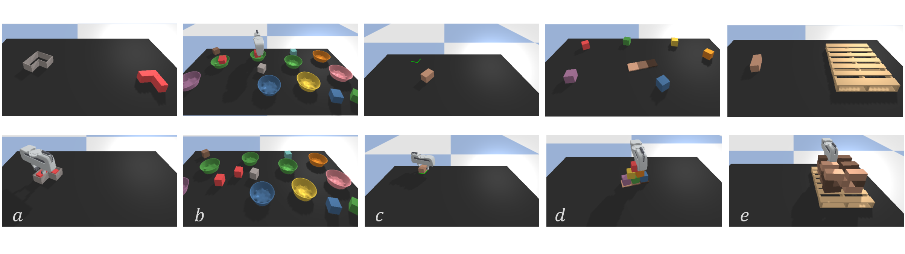

# Equivariant-Transporter-Net
[Project Website](https://haojhuang.github.io/etp_page/)&nbsp;&nbsp;•&nbsp;&nbsp;[PDF](https://arxiv.org/abs/2202.09400)&nbsp;&nbsp;•&nbsp;&nbsp; **RSS 2022**

*Haojie Huang, Dian Wang, Robin Walters, Robert Platt*

**Abstract.** [Transporter Net](https://arxiv.org/pdf/2010.14406.pdf) is a recently proposed framework for pick and place that is able to learn good manipulation policies from a very few expert demonstrations. A key reason why Transporter Net is so sample efficient is that the model incorporates rotational equivariance into the pick module, i.e. the model immediately generalizes learned pick knowledge to objects presented in different orientations. This paper proposes a novel version of Transporter Net that is equivariant to both pick and place orientation. As a result, our model immediately generalizes place knowledge to different place orientations in addition to generalizing pick knowledge as before. Ultimately, our new model is more sample efficient and achieves better pick and place success rates than the baseline Transporter Net model.

## Panda-gripper Simulation Environment for Pick and Place

The experiment part of our paper is based on [Ravens](https://github.com/google-research/ravens), a simulation environment in PyBullet for 2D robotic manipulation with emphasis on pick and place. Since Ravens uses suction gripper that doesn't require pick angle inference, we select five tasks described below and provide a **Panda-Gripper version simulated Environment**. 
It inherits the Gym-like API from Ravens, each with (i) a scripted oracle that provides expert demonstrations and (ii) reward functions that provide partial credit.

<br>

(a) **block-insertion**: pick up the L-shaped red block and place it into the L-shaped fixture.<br>
(b) **place-red-in-green**: pick up the red blocks and place them into the green bowls amidst other objects.<br>
(c) **align-box-corner**: pick up the randomly sized box and align one of its corners to the L-shaped marker on the tabletop.<br>
(d) **stack-block-pyramid**: sequentially stack 6 blocks into a pyramid of 3-2-1 with rainbow colored ordering.<br>
(e) **palletizing-boxes**: pick up homogeneous fixed-sized boxes and stack them in transposed layers on the pallet.<br>


## Highlight

It is worth noting that our proposed method, Equivariant Transporter Network can achieve more sample efficiency and faster converge speed. Taking the block-insertion task for example, it can hit ~100% success rate when trained with 1 expert demonstration for 200 SGD steps (less than 2 minutes). More results could be found in our paper.

## Installation

**Step 1.** Recommended: install [Miniconda](https://docs.conda.io/en/latest/miniconda.html) with Python 3.7.

**Step 2.** Install Pytorch (Test on Pytorch 1.8.1 and Cuda 10.2)
```commandline
conda install pytorch==1.8.1 torchvision==0.9.1 torchaudio==0.8.1 cudatoolkit=10.2 -c pytorch
```
**Step 3.** Install the required packages

```shell
pip install -r ./requirements.txt
```
(friendly note: It's a little awkward to install tensorflow that is not used for training. A tensorflow without cuda is ok since the model is trained with pytorch. Latter update will remove tensorflow and provied a pure-pytorch version that also enable batch training.)

## Getting Started

**Step 1.** Generate training and testing data.

```shell
python gripper_get_demo.py  --mode train --task block-insertion --n 10  --disp
python gripper_get_demo.py  --mode test  --task block-insertion --n 100 --disp
```


**Step 2.** Train a model e.g., Equivariant Transporter. Parameters are saved to the `checkpoints_{model}` directory. 

```shell
python train.py --equ --lite --angle_lite --task=block-insertion --n_demos 1 --interval 200 --n_steps 1000 --init
```

**Step 3.** Evaluate the model trained for 200 iterations with 1 demos. Results are saved to the `test_{model}` directory.

```shell
python gripper_test.py --equ --lite --angle_lite --task=block-insertion --n_demos 1 --n_steps 200 --disp=True
```

[//]: # (**Step 4.** Plot and print results.)

## More description

**Models:** Equivariant Transporter Network (`--equ`); Equivariant Transporter Network with a Tail Network(`--equ_tail`);  Pytorch-version Transporter Net(`--non`); Hybrid Models (`--femi` and `--semi`).
Equivariant Transporter Network with a Tail Network performs well with a slightly long training time.

**Observations:** RGB-D images (4X320X160)

**Actions:** Picking: (u,v,theta); Placing: (u,v,theta)

## Future Updates

- Equivairant Transporter Network without Picking angle inference.
- Pure Pytorch implementation
- Batch training
- Goal-conditioned tasks and models.

